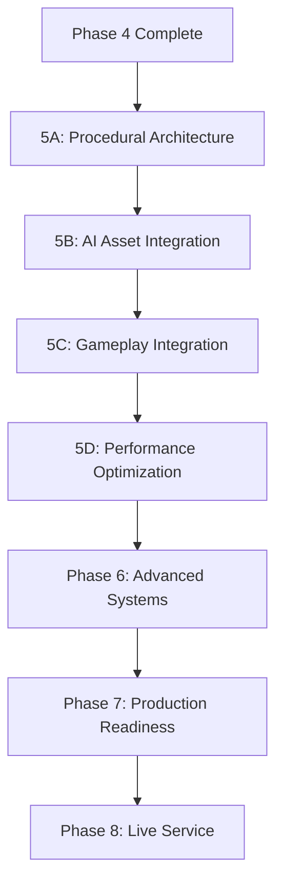

# Terminal Grounds - Master Development Roadmap 2025

**Document Version**: 1.0  
**Last Updated**: August 28, 2025  
**Status**: Phase 4 Bold Systems Complete → Phase 5 Procedural Generation Planning

## Executive Summary

Terminal Grounds has achieved critical milestones in Phase 4 with complete Bold systems implementation (Splice Events, Convoy Economy, Trust System, Codex), 92% asset generation pipeline success rate, and operational territorial warfare infrastructure. This roadmap consolidates expert analysis from CTO-Architect, Chief Design Officer, Chief Art Director, and Performance Engineer perspectives to chart the path from current state through full production release.

## Current State Assessment

### ✅ Completed Systems (Phase 4 Bold - August 2025)

#### Core Gameplay Systems (UE5 C++)

- UTGSpliceSubsystem: Dynamic narrative events with faction consequences
- UTGConvoyEconomySubsystem: Economic warfare with Integrity Index mechanics
- UTGTrustSubsystem: Player reputation and faction relationship tracking
- UTGCodexSubsystem: Progressive lore unlocking system

#### Territorial Warfare Infrastructure

- SQLite territorial database (0.04ms query performance)
- WebSocket server supporting 100+ concurrent players
- AI faction behavior system with strategic decision-making
- Real-time territorial visualization dashboard

#### Asset Generation Pipeline

- 92% success rate with FLUX1-dev-fp8 integration
- 109+ professional assets generated (enterprise-scale production)
- Chief Art Director visual identity framework complete
- Production-ready workflow system with quality assurance

#### Technical Foundation

- UE5.6 C++ modular architecture
- Persistent save system with UTGProfileSave
- Complete UI widget framework (TGUI)
- Build system with proper dependency management

### 🎯 Next Phase: Procedural Generation System

The roadmap transitions from asset generation mastery to procedural world creation, integrating AI-generated content with dynamic territorial-driven environments.

---

## Phase 5: Procedural World Foundation (Q4 2025)

*Timeline: 3-4 months | Priority: Critical*

### 5A. Procedural Architecture (Month 1)

#### Technical Implementation (CTO-Architect Priority)

- Complete UTGProceduralWorldSubsystem implementation
- Integrate with existing territorial warfare infrastructure
- Create UE5 landscape generation integration
- Establish biome transition algorithms

#### Core Systems

```cpp
// Key Classes to Implement
UTGProceduralWorldSubsystem  // Main controller
ATGProceduralTestActor      // Editor testing framework
UTGBiomeGenerator          // Faction-driven environmental zones
UTGStructurePlacer         // AI asset integration system
```

#### Success Criteria

- Procedural landscape generation operational
- Faction-driven biome transitions working
- Integration with territorial control complete
- Editor tools functional for level designers

### 5B. AI Asset Integration (Month 2)

#### Art Pipeline Integration (Chief Art Director Priority)

- Integrate 92% success asset pipeline with procedural placement
- Create faction-aware building selection algorithms
- Implement environmental storytelling through asset placement
- Establish quality consistency across procedural content

#### Visual Cohesion Framework

- Art pillar enforcement in procedural generation
- Faction aesthetic consistency validation
- Environmental narrative through asset relationships
- Lighting and atmosphere integration

### 5C. Gameplay Systems Integration (Month 3)

#### Game Design Implementation (Chief Design Officer Priority)

- Integrate Splice Events with procedural environments
- Create dynamic extraction points based on territorial control
- Implement convoy route generation
- Establish trust system integration with procedural NPCs

#### Player Experience Features

- Adaptive difficulty through procedural encounter design
- Faction reputation affecting environmental generation
- Dynamic mission generation based on territorial state
- Progressive content unlocking through Codex integration

### 5D. Performance Optimization (Month 4)

#### Scalability Engineering (Performance Engineer Priority)

- Implement LOD systems for procedural content
- Create streaming optimization for large procedural worlds
- Establish memory management for AI asset caching
- Optimize real-time territorial updates during procedural generation

#### Performance Targets

- 60+ FPS during active procedural generation
- <2GB memory footprint for procedural systems
- <100ms response time for territorial updates
- Support for 8km² procedural maps

---

## Phase 6: Advanced Procedural Systems (Q1 2026)

### 6A. Dynamic Content Systems

#### Timeline: 3-4 months | Priority: High

#### Narrative Integration

- Procedural quest generation based on territorial state
- Dynamic faction conflict zones
- Adaptive lore delivery through environmental storytelling
- AI-driven dialogue generation for procedural NPCs

#### Economic Systems

- Procedural supply chain generation
- Dynamic market creation based on territorial control
- Convoy route optimization algorithms
- Resource scarcity simulation

### 6B. Multiplayer Procedural Synchronization

#### Network Architecture

- Deterministic procedural generation across clients
- Efficient synchronization of procedural changes
- Territorial update integration with procedural systems
- Anti-cheat measures for procedural content

#### Scalability Features

- Support for 100+ players in procedural environments
- Regional server architecture for large-scale maps
- Load balancing for procedural generation compute
- Graceful degradation under high load

### 6C. Advanced AI Systems

#### Faction AI Enhancement

- Strategic procedural base construction
- Dynamic patrol route generation
- Adaptive combat encounter design
- Intelligence-driven territorial expansion

#### Player Behavior Analytics

- Heat map analysis for procedural optimization
- Player preference learning for content generation
- Churn prediction through engagement metrics
- A/B testing framework for procedural parameters

---

## Phase 7: Production Readiness (Q2 2026)

### Timeline: 2-3 months | Priority: Critical

### 7A. Quality Assurance & Testing

#### Automated Testing Systems

- Procedural content validation pipelines
- Performance regression testing
- Visual quality assessment automation
- Gameplay balance verification tools

#### Security & Anti-Cheat

- Territorial system security audit
- Procedural generation exploit prevention
- Client-server validation for procedural content
- Fraud detection for economic systems

### 7B. DevOps & Deployment

#### Production Infrastructure

- CI/CD pipeline for procedural content
- Automated asset generation integration
- Performance monitoring dashboards
- Disaster recovery procedures

#### Launch Preparation

- Beta testing program with procedural content
- Community feedback integration systems
- Launch day monitoring and support systems
- Post-launch content update pipeline

---

## Phase 8: Live Service Operations (Q3 2026+)

### Timeline: Ongoing | Priority: Maintenance

### 8A. Content Expansion

#### Seasonal Content

- Procedural event generation for seasons
- Dynamic faction balance updates
- New biome and asset integration
- Community-driven content creation tools

### 8B. Analytics & Optimization

#### Data-Driven Improvements

- Player retention analysis
- Procedural content effectiveness metrics
- Economic system balance monitoring
- Performance optimization based on usage patterns

---

## Implementation Priority Matrix

### Critical Path Dependencies



### Resource Allocation

#### Engineering (60%)

- UE5 C++ procedural systems
- Network architecture optimization
- Performance engineering
- DevOps automation

#### Art & Design (25%)

- Asset pipeline integration
- Visual quality assurance
- Environmental art direction
- User experience design

#### QA & Analytics (15%)

- Automated testing systems
- Performance monitoring
- Security validation
- Data analysis infrastructure

## Risk Mitigation Strategies

### High-Risk Areas

#### Technical Complexity

- *Risk*: Procedural generation performance impact
- *Mitigation*: Incremental implementation with performance gates
- *Fallback*: Pre-generated content system as backup

#### Asset Pipeline Integration

- *Risk*: 92% success rate degradation under procedural load
- *Mitigation*: Dedicated asset generation servers
- *Fallback*: Asset caching and fallback systems

#### Network Synchronization

- *Risk*: Deterministic procedural generation across 100+ players
- *Mitigation*: Seed-based generation with validation checkpoints
- *Fallback*: Server-authoritative generation with client prediction

### Success Metrics

#### Phase 5 KPIs

- Procedural map generation: <60 seconds for 2km² area
- Asset integration success: Maintain 85%+ quality scores
- Performance: 60+ FPS during active generation
- Stability: <1% crash rate during procedural operations

#### Long-term Success Indicators

- Player retention: 70%+ 30-day retention
- Content freshness: 80%+ of players experience unique content
- Performance: Consistent 60+ FPS on target hardware
- Community engagement: Active modding/content creation community

## Technology Integration Points

### Current System Leverage

#### Territorial Warfare

- Faction influence affects procedural biome selection
- Territorial control determines asset density and types
- Real-time updates trigger procedural environment changes
- WebSocket infrastructure supports procedural synchronization

#### AI Asset Generation Pipeline

- 92% success rate integrated into procedural placement
- FLUX1-dev-fp8 model supports real-time asset variation
- Quality assurance system validates procedural content
- Chief Art Director framework ensures visual consistency

#### Gameplay Systems

- Splice Events create procedural mission variations
- Convoy Economy affects procedural resource distribution
- Trust System influences procedural NPC interactions
- Codex System unlocks procedural content tiers

## Conclusion

This master roadmap synthesizes expert analysis across technical, design, artistic, and performance domains to create a comprehensive development strategy. The transition from Phase 4's foundation systems to Phase 5's procedural generation represents a natural evolution of Terminal Grounds' core strengths: territorial warfare, AI asset generation, and faction-driven gameplay.

The roadmap balances ambitious technical goals with pragmatic implementation strategies, ensuring sustainable development velocity while maintaining the high quality standards established in previous phases. Success depends on leveraging existing system strengths while carefully managing the complexity introduction of procedural generation.

### Next Immediate Actions

1. Begin UTGProceduralWorldSubsystem implementation
2. Create procedural integration tests with existing territorial system
3. Establish performance benchmarks for procedural generation
4. Design asset pipeline integration architecture

---

*This document represents the consolidated expertise of specialized development agents and should be updated quarterly based on implementation progress and market conditions.*
