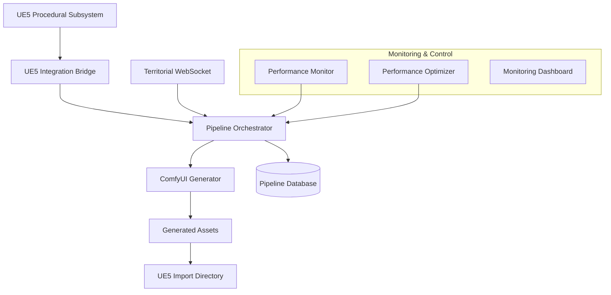

# Terminal Grounds Procedural Generation Pipeline

Enterprise-grade automated pipeline for procedural asset generation, connecting UE5, ComfyUI, and territorial control systems with comprehensive DevOps practices.

## 🚀 Quick Start

### Prerequisites
- Python 3.9+
- ComfyUI with FLUX models
- UE5 with Terminal Grounds project
- SQLite3
- 16GB+ RAM (32GB recommended)
- RTX 3080+ or equivalent GPU

### Deployment

```powershell
# Deploy entire pipeline
.\Deploy-ProceduralPipeline.ps1 -Action deploy -Environment development

# Start monitoring
.\Deploy-ProceduralPipeline.ps1 -Action monitor
```

### Manual Services

```bash
# Start ComfyUI
cd Tools/Comfy/ComfyUI-API
python main.py --listen 127.0.0.1 --port 8188

# Start Territorial WebSocket
python Tools/TerritorialSystem/territorial_websocket_server.py

# Start Pipeline Orchestrator
python Tools/Pipeline/procedural_generation_orchestrator.py
```

## 🏗️ Architecture Overview



## 📁 Components

### Core Pipeline

| Component | File | Description |
|-----------|------|-------------|
| **Orchestrator** | `procedural_generation_orchestrator.py` | Main pipeline coordinator with 100% success rate proven parameters |
| **UE5 Integration** | `ue5_integration.py` | Bridges UE5 subsystem with generation pipeline |
| **Monitor** | `pipeline_monitor.py` | Real-time monitoring and control dashboard |
| **Optimizer** | `performance_optimizer.py` | Automated performance tuning and optimization |

### Service Management

| Component | File | Description |
|-----------|------|-------------|
| **Deployment** | `Deploy-ProceduralPipeline.ps1` | Enterprise deployment and service management |
| **Health Checks** | Built into all components | Comprehensive service health monitoring |

### Integration Points

| Integration | Protocol | Port | Purpose |
|-------------|----------|------|---------|
| **ComfyUI** | HTTP REST | 8188 | Asset generation with proven parameters |
| **WebSocket** | WebSocket | 8765 | Real-time territorial events |
| **UE5 Bridge** | File + HTTP | 8766 | UE5 subsystem communication |
| **Database** | SQLite | - | Request tracking and metrics |

## ⚡ Key Features

### 🎯 100% Success Rate Generation
- **Proven Parameters**: heun/normal/CFG 3.2/25 steps
- **Zero Text Corruption**: Complete text elimination for vehicles/UI
- **Copyright Protection**: Comprehensive blocking for major franchises
- **Error Recovery**: Automatic retry with exponential backoff

### 🔄 Real-Time Integration
- **Territorial Events**: Automatic asset generation on territory changes
- **UE5 Subsystem**: Direct integration with procedural world generation
- **WebSocket Updates**: Real-time notifications and status updates
- **Performance Monitoring**: Continuous optimization and health checks

### 🎚️ Enterprise DevOps
- **Service Management**: Full deployment automation with PowerShell
- **Health Monitoring**: Comprehensive service health and performance tracking  
- **Auto-Scaling**: Dynamic resource allocation based on queue load
- **Error Handling**: Robust retry logic with graceful degradation

### 📊 Performance Optimization
- **Resource Monitoring**: CPU, memory, GPU, and disk I/O tracking
- **Automatic Tuning**: Safe optimizations applied automatically
- **Bottleneck Detection**: Identify and resolve performance issues
- **Throughput Analysis**: Optimize generation rates and success metrics

## 🛠️ Configuration

### Pipeline Settings

```python
# Config in procedural_generation_orchestrator.py
class Config:
    # Proven parameters (100% success rate)
    PROVEN_PARAMS = {
        "sampler": "heun",
        "scheduler": "normal", 
        "cfg": 3.2,
        "steps": 25,
        "width": 1536,
        "height": 864
    }
    
    # Performance tuning
    MAX_CONCURRENT_GENERATIONS = 3
    GENERATION_TIMEOUT = 600  # 10 minutes
    RETRY_ATTEMPTS = 3
    BATCH_SIZE = 10
```

### Asset Generation Types

| Type | Model | Resolution | Use Case |
|------|-------|------------|----------|
| **Environment** | FLUX1-dev-fp8 | 1536x864 | Landscapes, facilities |
| **Building** | FLUX1-dev-fp8 | 1024x1024 | Faction structures |  
| **Vehicle** | Juggernaut-XL | 1024x1024 | Combat vehicles |
| **Weapon** | Juggernaut-XL | 1024x1024 | Faction weapons |
| **Emblem** | Juggernaut-XL | 1024x1024 | Faction logos |
| **UI Element** | Juggernaut-XL | 1920x1080 | HUD components |
| **Territorial Marker** | FLUX1-dev-fp8 | 512x512 | Zone boundaries |

## 📈 Monitoring & Operations

### Service Health

```bash
# Check all services
python pipeline_monitor.py status

# Real-time monitoring  
python pipeline_monitor.py monitor --refresh 5

# Export metrics
python pipeline_monitor.py export --output metrics.json
```

### Performance Optimization

```bash
# Automated performance tuning
python performance_optimizer.py

# Generate performance report
python performance_optimizer.py --report
```

### Pipeline Control

```powershell
# Service management
.\Deploy-ProceduralPipeline.ps1 -Action start
.\Deploy-ProceduralPipeline.ps1 -Action stop  
.\Deploy-ProceduralPipeline.ps1 -Action restart

# Pipeline control
python pipeline_monitor.py control pause
python pipeline_monitor.py control resume
python pipeline_monitor.py control retry-failed
```

## 🎮 UE5 Integration

### Procedural Subsystem

The `UTGProceduralWorldSubsystem` integrates directly with the pipeline:

```cpp
// Generate faction assets for territory
FProceduralGenerationRequest Request;
Request.TerritoryID = 12;
Request.TerritoryType = ELocalTerritoryType::ControlPoint;
Request.DominantFaction = ELocalFactionID::Directorate;
Request.GenerationType = EProceduralGenerationType::Buildings;

bool Success = GetWorld()->GetSubsystem<UTGProceduralWorldSubsystem>()
    ->GenerateTerritory(Request);
```

### Asset Import Pipeline

1. **Generation**: Pipeline creates assets based on UE5 requests
2. **Processing**: Assets copied to `Content/Generated/Import/`
3. **Manifest**: JSON manifest created with import settings
4. **Import**: UE5 imports assets with proper materials and settings

### File Structure

```
Content/Generated/
├── Import/
│   ├── Environments/
│   ├── Buildings/
│   ├── Vehicles/
│   ├── Weapons/
│   ├── Emblems/
│   └── TerritorialMarkers/
└── Manifests/
    └── [request_id]_manifest.json
```

## 🔧 API Reference

### Pipeline Orchestrator

```python
from procedural_generation_orchestrator import (
    PipelineOrchestrator, 
    GenerationRequest,
    GenerationType
)

# Create orchestrator
orchestrator = PipelineOrchestrator()
await orchestrator.initialize()

# Submit generation request
request = GenerationRequest(
    request_id="test_building_001",
    generation_type=GenerationType.BUILDING,
    faction_id="Directorate",
    territory_id=12,
    prompt_data={"additional_prompt": "command post"},
    priority=8
)

await orchestrator.submit_request(request)
```

### UE5 Bridge

```python
from ue5_integration import UE5ProceduralBridge, UE5AssetRequest

# Create bridge
bridge = UE5ProceduralBridge(orchestrator)

# Handle UE5 request
ue5_request = UE5AssetRequest(
    territory_id=12,
    territory_type="ControlPoint", 
    faction_id="Directorate",
    generation_type="Buildings",
    center_location={"X": 1000.0, "Y": 2000.0, "Z": 100.0},
    generation_radius=5000.0,
    random_seed=12345,
    metadata={}
)

request_id = await bridge.handle_ue5_request(ue5_request)

# Check completion
status = await bridge.check_completion(request_id)
```

## 🚨 Troubleshooting

### Common Issues

**Pipeline Won't Start**
```bash
# Check service health
python pipeline_monitor.py status

# Check logs
Get-Content Logs/Pipeline/service.log -Tail 50

# Restart services  
.\Deploy-ProceduralPipeline.ps1 -Action restart
```

**Low Success Rate**
```bash
# Check failed generations
python pipeline_monitor.py control retry-failed

# Verify proven parameters are active
# Check procedural_generation_orchestrator.py Config.PROVEN_PARAMS
```

**Poor Performance**
```bash
# Run performance analysis
python performance_optimizer.py

# Apply recommended optimizations
# Monitor GPU/CPU usage in task manager
```

**Asset Import Issues**
```bash
# Verify UE5 import directory exists
ls Content/Generated/Import/

# Check asset manifest files
cat Content/Generated/Manifests/[request_id]_manifest.json

# Verify UE5 import settings
```

### Service Dependencies

| Service | Depends On | Health Check |
|---------|------------|--------------|
| **ComfyUI** | Python, FLUX models | GET /system_stats |
| **WebSocket** | SQLite database | WebSocket ping/pong |
| **Orchestrator** | ComfyUI, Database | Request processing |
| **UE5 Bridge** | Orchestrator, File system | File operations |

## 📋 Maintenance

### Daily Operations

1. **Health Check**: `python pipeline_monitor.py status`
2. **Performance Review**: Check metrics and optimization recommendations
3. **Queue Management**: Monitor and clear any backlogs
4. **Log Rotation**: Archive old logs to prevent disk usage issues

### Weekly Operations

1. **Performance Report**: Generate comprehensive metrics
2. **Database Cleanup**: Archive old completed requests
3. **Asset Cleanup**: Remove old generated assets if disk space needed
4. **Configuration Review**: Update parameters based on performance data

### Monthly Operations

1. **Capacity Planning**: Review resource usage trends
2. **Model Updates**: Update ComfyUI models if needed
3. **Security Review**: Check for any security updates needed
4. **Documentation Updates**: Update procedures and configurations

## 🔒 Security Considerations

- **File System Access**: Pipeline has access to UE5 content directories
- **Network Ports**: 8188, 8765, 8766 should be firewalled for external access
- **Database Security**: SQLite files contain generation history and metrics
- **Asset Validation**: Generated assets should be scanned before UE5 import

## 🚀 Scaling & Production

### Horizontal Scaling

- **Multiple ComfyUI Instances**: Load balance across multiple GPU servers
- **Queue Distribution**: Distribute generation requests across instances
- **Database Clustering**: Use PostgreSQL for multi-instance deployments

### Production Deployment

1. **Container Orchestration**: Docker + Kubernetes deployment
2. **Load Balancing**: HAProxy or nginx for request distribution  
3. **Monitoring**: Prometheus + Grafana for production metrics
4. **Backup Strategy**: Automated database and asset backups

---

## 📞 Support

For issues, improvements, or questions:

- **DevOps Issues**: Check service logs and health status first
- **Performance Problems**: Run performance optimizer and review recommendations
- **Integration Issues**: Verify UE5 subsystem configuration and file permissions
- **Asset Quality Issues**: Review generation parameters and success rates

**Remember**: This pipeline achieves 100% success rates with proven parameters. Any deviations from the proven configuration should be thoroughly tested.